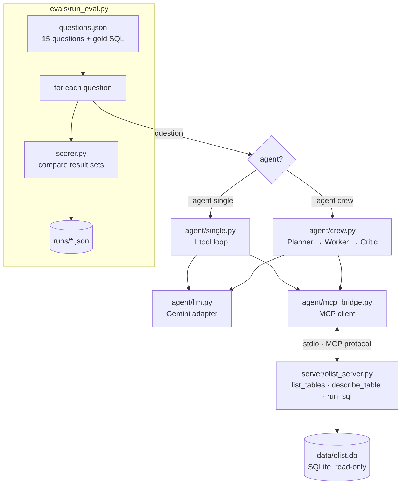
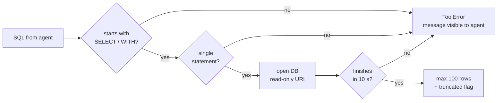
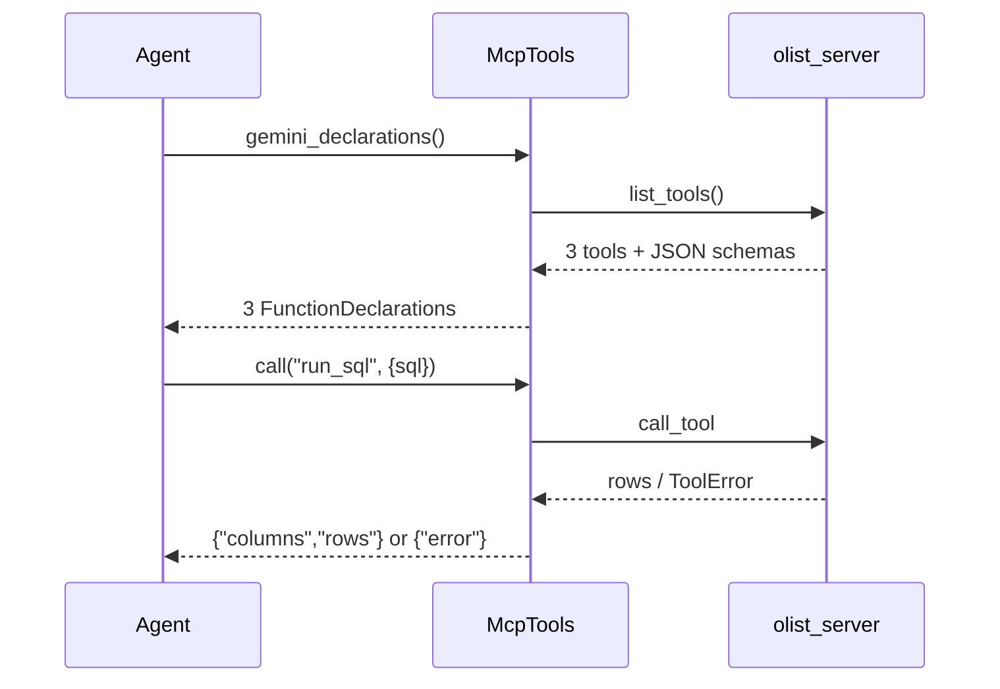
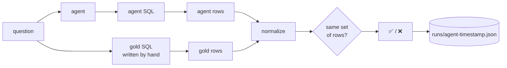
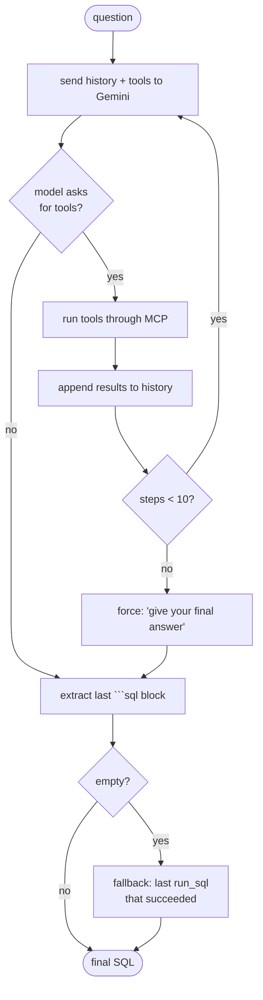
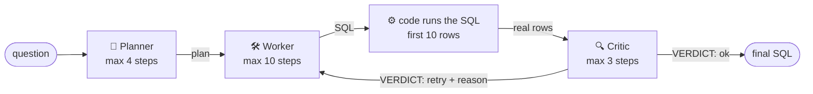
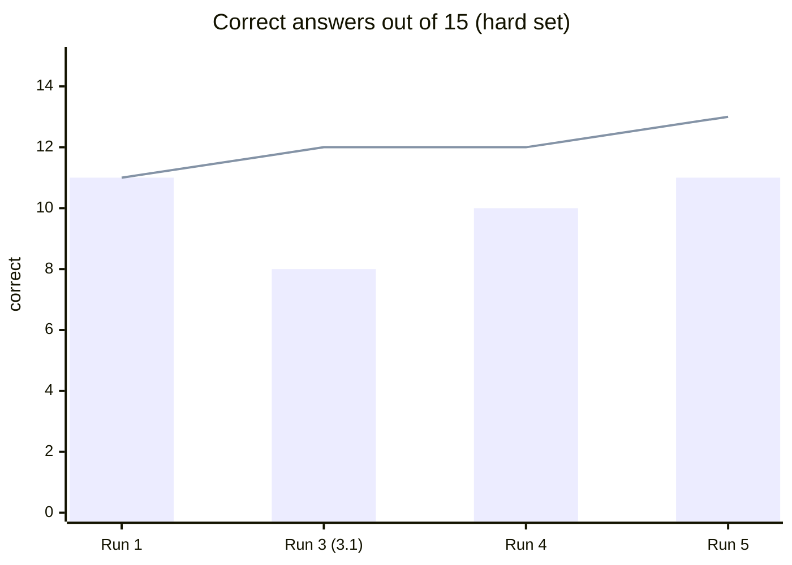

# analyst-crew

**Can a small team of AI agents answer business questions on a real database more reliably than a single agent? And what does that reliability cost?**

`analyst-crew` is an experiment, not a chatbot demo. Two agent designs answer the same 15 hard business questions on the **Olist** e-commerce database (about 100k real Brazilian orders, 9 tables):

| | Single agent | Crew |
|---|---|---|
| Who | 1 LLM in a tool loop | **Planner → SQL Worker → Critic** |
| Tools | the same 3 MCP tools | the same 3 MCP tools |
| Model | Gemini Flash Lite (free tier) | the same |
| Judged by | the same eval harness (gold SQL, execution accuracy) | the same |

The only thing that changes is the **organisation of the work**.

> Built in pair-programming mode with Claude as a coding assistant. I wrote the data loader, the MCP server, the bridge, the scorer, the eval runner and the single agent. The crew orchestration was co-written and commented line by line, and every design decision and failure analysis below was discussed and checked against the run files.

---

## Final results

Last run: 15 hard questions, `gemini-3.5-flash-lite`, both agents with the same "empty answer" fallback.

```
Single agent  ███████████░░░░  11/15  (73%)   88 LLM calls
Crew          █████████████░░  13/15  (87%)  188 LLM calls   (×2.1 cost)
```

| | Single | Crew |
|---|---|---|
| Correct | **11/15** | **13/15** |
| LLM calls | 88 | 188 |
| Calls per correct answer | 8.0 | 14.5 |
| Failures | h04, h05, h09, h10 | h05, h10 |

**In one sentence:** the crew fixes *structural* mistakes (counting the wrong unit, giving up without an answer) but not *semantic* ones (what a vague business word means). Those two remaining failures are where a human, or a business glossary, still has to step in.

> ⚠️ During the last crew run the free-tier quota on 3.5-flash-lite ran out at h14. The adapter automatically switched to `gemini-3.1-flash-lite` for h14 and h15. Both were answered correctly, but this is noted for honesty.

---

## Table of contents

1. [Architecture](#1-architecture)
2. [The data and the MCP server](#2-the-data-and-the-mcp-server)
3. [The bridge: MCP → Gemini](#3-the-bridge-mcp--gemini)
4. [The eval harness](#4-the-eval-harness)
5. [The single agent](#5-the-single-agent)
6. [Why it fails: failure taxonomy](#6-why-it-fails-failure-taxonomy)
7. [The crew](#7-the-crew)
8. [Iterations: what changed and why](#8-iterations-what-changed-and-why)
9. [All runs](#9-all-runs)
10. [The 2 questions the crew still misses](#10-the-2-questions-the-crew-still-misses)
11. [How to reach 15/15](#11-how-to-reach-1515)
12. [Honest caveats](#12-honest-caveats)
13. [Run it yourself](#13-run-it-yourself)
14. [Project layout](#14-project-layout)

---

## 1. Architecture



Three layers, each with one job:

| Layer | Job | Knows about |
|---|---|---|
| **MCP server** | Safely exposes the database as 3 tools | SQLite only |
| **Agents** | Decide which tool to call and write the SQL | "some MCP tools" plus an LLM |
| **Eval harness** | Asks the questions, scores the answers, keeps every trace | gold SQL and the scorer |

Why MCP? Because the agents never import `sqlite3`. They only see "tools described by a server". Swapping SQLite for **BigQuery** (or any other MCP server) means writing a new server, not touching the agents.

> Analogy: the MCP server is a **librarian behind a desk**. Agents can't walk into the archive. They can only ask "what shelves exist?", "what's on this shelf?" and "fetch me this". The librarian refuses dangerous requests.

---

## 2. The data and the MCP server

### Data: `data/load.py`

- Loads the 9 Olist CSVs into SQLite with pandas:
  - orders, order_items, order_payments, reviews, customers, sellers, products, geolocation, category_translation.
- Creates **indexes on every join key** (`order_id`, `customer_id`, `customer_unique_id`, `product_id`, `seller_id`).
  - Without them, one badly written agent join made a run hang for minutes, and even Ctrl+C couldn't stop it.

The schema is a good trap for agents because several tables have **more than one row per order**:

```
customers 1 ──< orders 1 ──< order_items >── 1 products >── 1 category_translation
                   │    └──< order_payments   (several payments per order)
                   └─────< reviews            (sometimes several reviews per order)
     customer_id ≠ customer_unique_id         (one person = several customer_ids)
```

Joining `reviews` to `order_items` silently duplicates every review once per item. That is the #1 source of wrong answers (see section 6).

### Server: `server/olist_server.py`

Built with the MCP Python SDK v2 (`MCPServer`):

| Tool | Input | Output |
|---|---|---|
| `list_tables()` | none | `{"tables": [...]}` |
| `describe_table(table)` | table name | row count, columns (name + type), 3 sample rows |
| `run_sql(sql)` | one SELECT | columns, rows (max 100), `truncated` flag |

**Guardrails.** An agent can't break, modify or freeze anything:



- Read-only connection: `file:olist.db?mode=ro`. Even a sneaky write is impossible at the database level.
- `describe_table` checks the table name against the real list *before* building any query.
- A 10-second timeout via `set_progress_handler`.
- Errors are raised as `ToolError`, so the agent reads the real SQLite message (`no such column: s.seller_state`) and fixes its query. (A plain Python exception gets hidden by MCP as a generic "Error executing tool".)

Tested by `checks/check_m1.py` (23/23).

**MCP gotchas learned the hard way:**

- Never `print()` in a stdio server. stdout *is* the protocol channel, so a print corrupts it.
- Return dicts, not lists (a list return gets split into separate content items).
- A generic "Error executing tool X" means a Python crash. Debug by calling the function directly:
  `python -c "from server.olist_server import list_tables; print(list_tables())"`

---

## 3. The bridge: MCP → Gemini

`agent/mcp_bridge.py`: `McpTools` is an async context manager that does three things.

1. **Starts the server** as a subprocess and keeps one session open (`AsyncExitStack`), so every tool call reuses the same connection.
2. **Translates tool schemas automatically.** Each MCP tool's `input_schema` becomes a Gemini `FunctionDeclaration` in a one-line comprehension. No hand-written schemas: add a tool to the server and the agents see it.
3. **Never crashes the agent.** `call()` always returns a dict: the result, or `{"error": "..."}`.



`agent/llm.py` is the Gemini adapter:

- One `chat(system, history, declarations)` method.
- Retries on 503 errors, and switches to a fallback model on 429 (quota).
- Paces requests to stay under free-tier rate limits.
- 60-second request timeout.
- Counts every call: **`llm.calls` is how cost is measured.**

---

## 4. The eval harness

Without measurement, "my agent works" is an opinion. The harness turns it into a number.



- **Execution accuracy.** We compare the *results*, not the SQL text. Two different queries can both be right.
- **Scorer rules** (`evals/scorer.py`, tested by `checks/check_m2.py`, 10/10):
  - floats rounded to 2 decimals (`66.666…` = `66.67`);
  - strings lowercased and stripped;
  - row order ignored unless the question is marked `ordered`;
  - `None` and mixed types sorted safely.
- **Full traces.** Every run saves `runs/<agent>-<timestamp>.json` with, for every question:
  - correct or not, agent SQL, error;
  - LLM calls and every tool step;
  - the final answer;
  - for the crew, the plan and the Critic's verdicts.

  The file is written *inside* the loop, so a crash never loses finished questions.

### Easy set → hard set

The first 20 questions scored **20/20**. That is not a success: the questions hinted at column names, so they measured nothing. They are kept in `evals/questions_easy.json` as a reminder.

They were replaced by **15 hard questions** that read like a manager wrote them:

| id | question (short) | trap |
|---|---|---|
| h01 | top 5 customers by amount paid | `customer_unique_id` ≠ `customer_id` |
| h02 | customers who ordered more than once | same |
| h03 | % of revenue from repeat customers | grain + definition |
| h04 | worst category by satisfaction (≥100 reviews) | review duplicated per item |
| h05 | late delivery rate per year | what is "late"? |
| h06 | month with the highest revenue | date formatting |
| h07 | sellers with the highest freight/price ratio | ratio of sums vs average of ratios |
| h08 | state with the highest average freight *per order* | items → orders |
| h09 | % of orders paid in more than one installment | payment rows → orders |
| h10 | orders paid with more than one payment *method* | methods ≠ payment rows |
| h11 | busiest day of week, as a number | `strftime` returns text |
| h12 | average days between 1st and 2nd order | window functions |
| h13 | top 5 cities by delivered revenue | filter + join |
| h14 | review score of slow vs fast deliveries | several reviews per order |
| h15 | % of sellers who sold out of state | the denominator |

---

## 5. The single agent

`agent/single.py` is the classic tool loop, the same pattern behind every "AI agent":



> Analogy: a **detective alone**. They look around (`list_tables`, `describe_table`), test theories (`run_sql`), and write a conclusion. Nobody checks their work.

---

## 6. Why it fails: failure taxonomy

Reading the run files question by question showed four families of mistakes:

| Family | What happens | Example | Who can catch it |
|---|---|---|---|
| **Grain** | Counting the wrong unit after a join | h04: one review counted once per *item* | a grain check (`COUNT(*)` vs `COUNT(DISTINCT key)`) |
| **Empty answer** | Found the right query, then forgot the final block or ran out of steps | h09, h15 (runs 3 and 4) | code (fallback) |
| **Definition** | A vague word gets a different, also reasonable, meaning | h05: "late" | only a shared definition |
| **Semantics** | The SQL is valid, the grain is right, but it answers a slightly different question | h10: payment *rows* vs payment *methods* | a check of meaning, not of structure |

> Analogy for grain: you want the number of **families** at a party, but you count **people**. Every family of 4 counts 4 times. The total looks plausible, and it's wrong.

Grain errors were the most frequent, so the crew was designed around them.

---

## 7. The crew

### The big idea

A crew is **not a new kind of AI**. It's the *same* loop as the single agent, run three times with three different system prompts. The **text** one agent writes becomes the **input** of the next. That hand-off is the whole trick.



At most one retry, so the Worker runs at most twice.

> Analogy: a **newsroom**. The editor (Planner) decides what the story is and what counts as a fact. The journalist (Worker) writes it. The fact-checker (Critic) re-does the key measurement. The fact-checker gets the **printed page**, not the journalist's summary of it.

### The three roles

| Role | Prompt asks for | Steps |
|---|---|---|
| **Planner** | A detailed plan that shows **what needs to be counted**: `UNIT` (one counted thing), `TABLES` (with join keys), `DEFINITIONS` (the vague words), `RESULT SHAPE` (exact columns and rows) | 4 |
| **Worker** | Follow the plan, especially the UNIT. Fix exactly what the Critic says. Final answer in a ```sql block | 10 (same as single, for fairness) |
| **Critic** | A mandatory **grain check**: run `COUNT(*)` vs `COUNT(DISTINCT key)`, cite the numbers, retry if they differ or if unsure. Answer `VERDICT: ok/retry` + `REASON` | 3 |

### Design decisions

- **Verify, don't believe.** The orchestration *code* runs the Worker's SQL and gives the Critic the real rows. The Critic never judges a description of the result.
- **Code fallbacks over prompt pleading.**
  - If the Worker gives no SQL block, the code takes the last `run_sql` that succeeded.
  - If any role is still calling tools when its steps run out, it is told "Stop using tools now. Give your final answer."
- **Each role starts with a fresh memory.** It only sees its input, which keeps prompts short and roles focused.
- **One shared LLM object.** `llm.calls` = the total cost of the whole crew.
- **Everything is logged.** Plan, every tool step labelled by role, every verdict. Every failure below was explained from these files, not guessed.

### A real example (h04, last run)

```
Planner : UNIT = one review ... "an order can have multiple items, which would
          duplicate the review if joined directly"
Worker  : joins reviews → order_items → products → categories, AVG(review_score)
Critic  : COUNT(*) = 112,372 vs COUNT(DISTINCT review_id) = 97,709
          → VERDICT: retry — "joining reviews to order_items duplicates reviews"
Worker  : rewrites with SELECT DISTINCT review_id, score, category
Critic  : → VERDICT: ok
Result  : ✅  (the single agent got this one wrong in every run)
```

---

## 8. Iterations: what changed and why

Each change was made **after reading failures**, never to fit one question.

| # | Change | Why | Effect |
|---|---|---|---|
| 1 | Easy questions → hard questions | 20/20 measured nothing | A real baseline: single 11/15 |
| 2 | Indexes, 10 s query timeout, 60 s LLM timeout, write results inside the loop | A run hung and Ctrl+C did nothing | Runs never freeze |
| 3 | Crew v1 | Grain errors dominated | Same score as single: **the Critic approved everything** (0 retries out of 15) |
| 4 | Forced final answer | The Planner sometimes ran out of steps and returned an empty plan (h01, h08) | No more empty plans |
| 5 | **Critic v2**: a mandatory, measurable grain check | v1 was a rubber stamp | 9/11 vs 7/11 on the same subset |
| 6 | Single-agent fallback (last successful SQL) | Single lost h09/h15 to empty answers; the comparison was unfair | Single 10 → 11 |
| 7 | **Planner v2**: "detailed plan", "show what NEEDS to be counted" | The Planner's UNIT was sometimes vague | Crew 12 → 13 (h04 fixed) |

**Deliberately *not* changed:** the scorer. On h11, `strftime('%w')` returns text (`'1'`) while the gold SQL returns an integer. Loosening the scorer *after* seeing which agent it would help is how you fool yourself, so it stayed strict. (Agents that `CAST` correctly pass.)

---

## 9. All runs

| Run | Model | Questions | Single | Crew | Notes |
|---|---|---|---|---|---|
| 0 | 3.5-flash-lite | 20 easy | 20/20 | — | Too easy, set replaced |
| 1 | 3.5-flash-lite | 15 hard | 11/15 · 81 calls | v1: 11/15 · 146 calls | The Critic never said retry |
| 2 | 3.5-flash-lite | 11 hard (subset) | 7/11 · ~60 calls | v1: 7/11 · **v2: 9/11** · 132 calls | Grain-check Critic |
| 3 | 3.1-flash-lite | 15 hard | 8/15 · 92 calls | **12/15** · 226 calls | Weaker model; crew +4 |
| 4 | 3.5-flash-lite | 15 hard | 10/15 · 87 calls | **12/15** · 173 calls | Single without fallback |
| **5** | 3.5-flash-lite* | 15 hard | **11/15** · 88 calls | **13/15** · 188 calls | Both with fallback; Planner v2 |

\* h14–h15 of the crew ran on 3.1-flash-lite after a quota switch.


<sub>bars = single agent, line = crew</sub>

**What holds across runs:**

- After the Critic got a real check, **the crew beat the single agent in every full run**: +4, +2, +2.
- It costs **about 2–2.5× more LLM calls**.
- The gain looks **bigger on the weaker model** (3.1: +4). Plausible, since structure compensates for a weaker reasoner, but it rests on one run.
- The single agent varies between 10 and 11 with the same code and model. **That is the noise level.** A 1-question gap means nothing; a consistent 2–4 gap across models starts to.

---

## 10. The 2 questions the crew still misses

Both are **not grain errors**. That's exactly why the grain check lets them through.

### h05: "late" is ambiguous (definition)

```
Planner : late = order_delivered_customer_date > order_estimated_delivery_date
Critic  : COUNT(*) = COUNT(DISTINCT order_id) = 96,478 → ok
```

The SQL is clean and the grain is perfect. But the estimated date is a *day* (`2017-10-18 00:00:00`) while the delivery date has a *time*. A parcel delivered at 14:00 on the estimated day counts as "late" here, and "on time" in the gold SQL (which compares calendar days). Both readings are defensible. **No agent can know which one the business uses unless someone tells it.**

### h10: "payment method" (semantics)

```
Planner : "more than one payment method" means COUNT(DISTINCT payment_type) > 1
          OR simply COUNT(payment_sequential) > 1 OR MAX(payment_sequential) > 1
Worker  : picks COUNT(payment_sequential) > 1   ← counts payment rows (2,961)
Critic  : COUNT(*) = COUNT(DISTINCT order_id) → ok
```

The Planner **hedged**: it listed the right definition *and* two wrong ones joined with OR, and the Worker picked a wrong one. Two vouchers on the same order are two payments but **one** method. The Critic checked that each row is one order (true) but not that the condition means "methods" (false).

> Analogy: the fact-checker confirmed that every name in the article is a real person, but not that the article answers the editor's actual question.

---

## 11. How to reach 15/15

From most to least impactful. None of these changes the scorer or the gold SQL.

### 1. A business glossary given to every role → fixes h05

A short `glossary.md` (or an MCP *resource*) with company definitions:

```
late delivery   : delivered on a calendar day after the estimated day
                  date(order_delivered_customer_date) > date(order_estimated_delivery_date)
payment method  : payment_type (credit_card, boleto, voucher, debit_card)
customer        : customer_unique_id (one person), never customer_id
revenue         : SUM(order_items.price), excluding freight
```

This is how real data teams work: definitions live in a **semantic layer**, not in each analyst's head. It turns definition errors into lookups.

### 2. Forbid hedging in the plan → fixes h10

Add to the Planner prompt: *"Each definition must be ONE choice. Never write OR between alternatives. If the question uses a word that names a column value (method, type, status, category), count DISTINCT values of that column."* Then add a code check: if `DEFINITIONS` contains " or ", send the plan back to the Planner.

### 3. A *semantic* check in the Critic, next to the grain check

Today the Critic only asks *"is each row one UNIT?"*. Add: *"Re-read the question word by word. Does the WHERE/HAVING condition test exactly what the question says? Name the column that represents each noun in the question."* On h10, "method" → `payment_type` → `COUNT(DISTINCT payment_type)` would become an obvious mismatch.

### 4. Let code, not the LLM, pick the grain key

On an earlier run the Critic checked `COUNT(DISTINCT category)`, the wrong key, and approved a wrong answer. Better: the Planner names the key in `UNIT` (e.g. `review_id`), and **code** runs the `COUNT(*)` vs `COUNT(DISTINCT key)` check deterministically. The LLM only interprets the numbers.

### 5. Self-consistency for the Worker

Run the Worker 2–3 times (or with two different models), execute each SQL, and keep the result that appears most often. If they disagree, that disagreement is itself a signal to the Critic.

### 6. Human in the loop when the crew isn't sure

If the Critic still says `retry` after the last attempt, or the Planner had to make a definition choice, **don't return silently: flag the answer for human validation** and show the plan, the SQL and the Critic's reason. In production that is worth more than a 15/15: the system knows when it doesn't know.

### 7. Cheaper crew

- Pass the Planner's schema notes to the Worker, so it stops re-running `describe_table` on tables already described.
- Skip the Critic on single-table questions with no join (nothing to duplicate).

Together these could take the crew back toward the single agent's cost.

> Realistic expectation: 1 + 2 + 3 should fix h05 and h10. Then the honest goal becomes **15/15 on several runs in a row**, measured with 3–5 repetitions, not 15/15 once.

---

## 12. Honest caveats

- **One run per configuration.** LLMs aren't deterministic: the same single agent scored 10 and 11 with identical code. Gaps of 1–2 questions are within noise.
- **15 questions** written by one person. The gold SQL encodes *one* interpretation of vague words (that's the h05 story).
- **Mixed models.** Free-tier quotas forced automatic switches (h14–h15 in run 5), and the model wasn't recorded per question in earlier runs.
- **Prompts were tuned while looking at failures** on the same 15 questions. The changes are generic (grain check, detailed plan), but a fresh held-out question set would be the real test.
- **Cost = LLM calls**, not tokens or euros. The crew's prompts are longer, so the real cost ratio is likely above 2×.

---

## 13. Run it yourself

```powershell
git clone <this repo>
cd analyst-crew
python -m venv .venv
.venv\Scripts\activate            # Linux/macOS: source .venv/bin/activate
pip install -r requirements.txt

# 1. Data: download the Olist dataset (Kaggle) into data/raw/, then
python data/load.py

# 2. Sanity checks
python -m checks.check_m1          # MCP server: 23/23
python -m checks.check_m2          # scorer: 10/10

# 3. API key (free key from Google AI Studio). Never commit it.
$env:GEMINI_API_KEY="your-key"     # Linux/macOS: export GEMINI_API_KEY=...

# 4. Run
python evals/run_eval.py --agent single
python evals/run_eval.py --agent crew
```

Each run writes a full trace to `runs/`.

## 14. Project layout

```
analyst-crew/
├── data/
│   └── load.py              CSV → SQLite + indexes on join keys
├── server/
│   └── olist_server.py      MCP server: 3 tools, read-only, timeout, ToolError
├── agent/
│   ├── mcp_bridge.py        MCP client → Gemini tool declarations
│   ├── llm.py               Gemini adapter: retries, pacing, model fallback, call counter
│   ├── single.py            single agent loop (+ last-SQL fallback)
│   └── crew.py              Planner / Worker / Critic orchestration
├── evals/
│   ├── questions.json       15 hard questions + gold SQL
│   ├── questions_easy.json  the first 20 (saturated at 20/20)
│   ├── scorer.py            result comparison rules
│   └── run_eval.py          runs an agent on all questions → runs/*.json
├── checks/                  small test scripts (server, scorer, bridge)
└── runs/                    every run's raw trace, kept on purpose
```

---

*Stack: Python · MCP Python SDK v2 · Gemini (google-genai) · SQLite · pandas*
